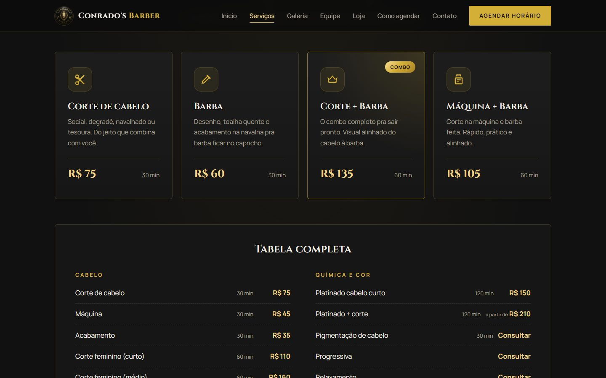

# 💈 Conrado's Barber — site da barbearia

Site institucional da **Conrado's Barber**, barbearia no bairro Santa Mônica, em Florianópolis (SC).
Feito do zero com **HTML, CSS e JavaScript puros**, sem frameworks.


<p align="center">
  
  &nbsp;&nbsp;
  
</p>

## ✨ Funcionalidades

- **Navegação em "páginas"** num único `index.html`: Início, Serviços, Galeria, Equipe, Loja, Como agendar e Contato.
  Cada página tem o próprio endereço (`#galeria`, `#loja`...) e o botão **voltar** do navegador funciona.
- **Agendamento pelo AppBarber**: todos os botões "Agendar" levam para a página da barbearia no app,
  e a página "Como agendar" tem os links da App Store e do Google Play.
- **Tabela de preços** completa, separada por categoria (cabelo, barba, combos, química e cor).
- **Galeria com lightbox**: abre a foto em tela cheia, com setas, teclado (← → Esc) e deslize do dedo no celular.
- **Aberto ou fechado agora**: calcula pelo horário de Brasília e destaca o dia de hoje na tabela de horários.
- **WhatsApp** com mensagem pronta (a da Loja já pergunta sobre os produtos).
- **Mapa do Google**, endereço clicável e botão "Traçar rota".
- **Responsivo**: menu ☰ no celular, botão de agendar fixo ao rolar e layout pensado para telas pequenas.
- **Animações leves**: entrada da capa, letreiro correndo e elementos que aparecem ao rolar.
  Quem ativa "reduzir movimento" no celular/PC vê o site sem animações.
- **Acessibilidade**: textos alternativos em todas as imagens e navegação pelo teclado.

## 🛠️ Tecnologias

- HTML5 semântico
- CSS3 (variáveis, Grid, Flexbox, `@keyframes`, media queries)
- JavaScript puro (IntersectionObserver, History API, `Intl.DateTimeFormat`)
- Google Fonts: Cinzel, Cormorant Garamond e Manrope

## 📁 Estrutura

```
├── index.html      → estrutura de todas as páginas
├── css/style.css   → todos os estilos
├── js/inicio.js    → roda no <head> e liga as animações
├── js/script.js    → navegação, lightbox, horários, links do AppBarber e WhatsApp
├── img/            → logo, fotos da barbearia, equipe, galeria e loja
└── docs/           → prints usados neste README
```

## ▶️ Como rodar

Não precisa instalar nada: basta abrir o `index.html` no navegador.
Para atualizar sozinho enquanto edita, use a extensão **Live Server** do VS Code.

As configurações (link do AppBarber, WhatsApp e horários) ficam no começo do `js/script.js`.

## 📌 Observações

- O agendamento abre no site do AppBarber porque ele **não permite** ser exibido dentro de outro site (iframe).
- Fotos, logo e nome são da **Conrado's Barber** e foram usados com autorização. O código é de minha autoria.

---

Desenvolvido por **Mateus Zanela**.
